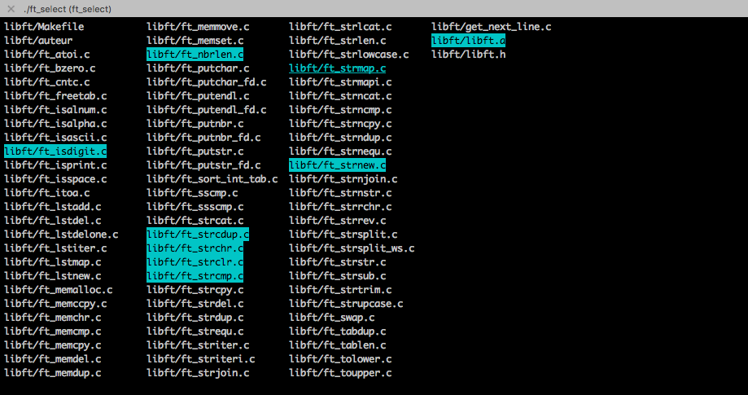

#ft_select
  
Projet Ecole 42
  
##Synopsis
  
Ce progamme utilise la bibliothèque termcaps, il permet de selectionner un ou plusieurs choix dans une liste passée en paramètre pour le(s) afficher sur la sortie standard.

####Touches utilisables :
  
* touches directionelles : se déplacer dans la liste
* espace : sélectionner/désélectionner un element 
* entrer : retourner les choix sélectionnés au shell
* Ctrl-c/escape : quite le programme proprement
* Ctrl-z/fg : suspend/reprend le progamme
* delete/backspace : supprime un élément de la liste
* gestion du redimensionnement de la fenêtre
  

